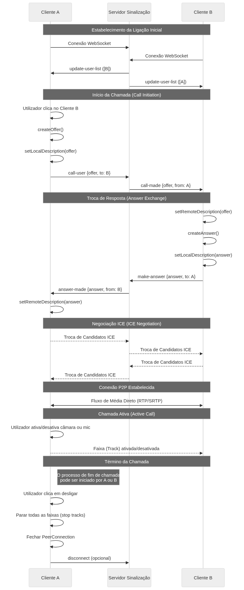

# WebRTC Video Chat

A browser-based peer-to-peer video chat app built from scratch with WebRTC — no third-party video SDKs, no media servers in the middle. Just two browsers talking directly to each other.

Built for a university course on Multimedia Communication Networks and Services, as a practical deep-dive into how real-time communication actually works under the hood of tools like Zoom or Google Meet.

---

## System Architecture

```
┌─────────────────┐         ┌──────────────────┐         ┌─────────────────┐
│    Client A     │◄───────►│  Signaling       │◄───────►│    Client B     │
│                 │         │  Server          │         │                 │
│ • getUserMedia  │         │  (Socket.IO)     │         │ • getUserMedia  │
│ • PeerConnection│         │                  │         │ • PeerConnection│
│ • UI Controls   │         └──────────────────┘         │ • UI Controls   │
└────────┬────────┘                                      └────────┬────────┘
         │                                                        │
         │              ┌──────────────────┐                      │
         └─────────────►│  STUN Server     │◄─────────────────────┘
                        │  (Google)        │
                        └──────────────────┘
         
         ═══════════════════════════════════════════════════════════
                    P2P Media Stream (after connection)
```

---

## What It Does

Two users open the app, and it negotiates a direct connection between their browsers. Once connected, audio and video stream peer-to-peer — the media never touches a server. Either participant can mute, toggle their camera, or end the call at any time.

The app also detects in real time when someone joins or leaves, so there's no manual room code to share — presence is automatic.

---

## How the Connection Works

WebRTC connections don't just happen — browsers need a way to find each other and agree on how to communicate before the direct link can be established. This app handles that in two steps:

1. **Signaling** — A lightweight Node.js server (Socket.IO) acts as a matchmaker, passing connection metadata between the two browsers just long enough to get them introduced
2. **Traversal** — Once introduced, a STUN server helps both browsers figure out their public-facing addresses so the direct connection can punch through routers and firewalls. A TURN server acts as a fallback relay if a direct path isn't possible

After that handshake, the server steps back and the stream goes entirely peer-to-peer.



---

## Tech Stack

| | |
|---|---|
| **Signaling server** | Node.js + Express + Socket.IO |
| **Server language** | TypeScript |
| **Client** | Vanilla JavaScript + WebRTC APIs |
| **STUN** | Google (`stun.l.google.com`) |
| **TURN fallback** | OpenRelay |

---

## Running It

```bash
npm install
npm run dev
```

Open `localhost` in two browser tabs (or two devices on the same network) to test a call.

Requires Node.js 18+ and a modern browser (Chrome 90+, Firefox 88+, Safari 15+).
- npm ou yarn
- Navegador moderno (Chrome 90+, Firefox 88+, Safari 15+)
